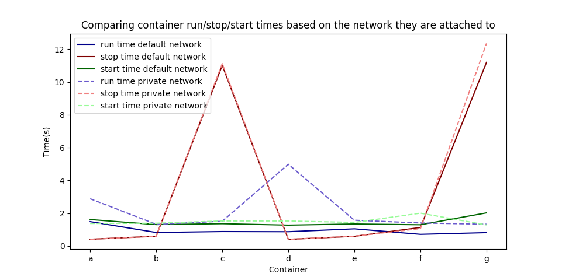

This will experiment with docker containers to test different hypotheses.

## Background

### Images

This describes the images that were used in this project.

| Image       | Description | 
| ----------- | ----------- |
| alpine      | alpine is a Linux distribution based on busybox |
| centos      | centos is a Linux distribution based on RedHat |
| hello-world | hello-world is a tester to test the docker setup on the computer and print hello world |
| nginx       | nginx is a reverse proxy server |
| splunk      | splunk is a fully functional splunk setup (with a web server) |

## Part 1

This was an experiment to test what docker containers would continue running if they were "revived" through running `docker start <container>`

### Hypothesis

A docker container will only continue running when "revived" if it is a container that will continously run when initially started.

A docker container that will continuously run when initially started will have one of the following qualities.
1. The docker container is running a program that will accept commands
2. The docker container is opening a port that will accept commands 

For example:
Docker Splunk will continuously run when invoked because of the fact that it opens an HTTP port that will accept commands

### Methodology

To test this, I created many different containers with different build images and different options put into the images. To test simple programs I used `alpine` and `hello-world`. To test running a program on an image I used `centos` and `/bin/bash`. To test opening ports and web servers I used `nginx` and `splunk`. 

I also tested if docker command line options to `run` would affect the outcome of certain images. I tested `--detach` which claims to keep containers running in the background. I also tested `-t` which allocates a pseudo-tty.

After creating the containers, I print the status of them, stop them, and start them again.
Finally, I check the status one more time to see if they started running and were "revived".

### Results

| Image       | Options       | Program   | Initial State            | Outcome        |
| ----------- | ------------- | --------- | ------------------------ | -------------- |
| alpine      | None          | None      | Did not continuously run | Did not revive |
| alpine      | --detach      | None      | Did not continuously run | Did not revive |
| alpine      | --detach, -t  | None      | Continuously ran         | Revived        |
| centos      | --detach      | /bin/bash | Did not continuously run | Did not revive |
| hello-world | None          | None      | Did not continuously run | Did not revive | 
| nginx       | --detach      | None      | Continuously ran         | Revived        | 
| splunk      | --detach, -e  | None      | Continuously ran         | Revived        | 

### Conclusion

The hypothesis seems to be correct. It seems as though only containers that run programs that will accept input or commands, such as opening a TCP port or a terminal in detach mode, will continue running after booting, and can be revived using `docker start <container>`.

## Part 2

This was an experiment to mess around with Docker Networking.

You can launch containers on your own personal network and I want to see how this compares to the default docker network, if it does.

### Explanation

Networking options
1. Default docker bridge
    - there is a container host
    - iptables/NAT with linux kernel
    - the  bridge will hold containers off of it
    - the containers talking to each other happens over the bridge
2. User defined bridge
    - container host
    - iptables/NAT with linux kernel
    - user defined bridge(s)
    - containers on the bridges with `--net` command
    - this allows isolation between containers, containers on different bridges cannot talk to each other
3. Overlay networking
    - two container hosts
    - both with iptables/NAT and bridges
    - this allows VM's or hosts to connect to an overlay
    - multihost network using the overlay rather than NATing to talk

### Useful Commands
`docker network ls`
- shows the network
- there is a default bridge, none, and host through docker originally

`docker network create --driver bridge <name>`
- creates a bridge network called isolated_nw

`docker network inspect <name>`
- shows the containers attached to the bridge and more information

`brctl show`
- shows the virtual bridges running
- depends on bridge-utils

### Hypothesis

Using the user defined bridges will have more overhead with simple docker commands because of the trade off of speed for security than the default docker bridge will.
(Also will probably have more overhead with handling requests on the containers themselves, but this wasn't tested)

### Methodology

Attach containers to the default bridge and to a user defined bridge and measure the speed it takes to run docker commands on the containers (run, stop, start). I did this 5 times and averaged the results to remove the potential for any outliers in the data.

### Results

### Conclusion

As we can see, the only major difference is that some of the containers take about 5 seconds longer to run and only slightly longer to start. Overall it seems like there is not much overhead with running things in their own network. However, more testing would need to be done to see if there is overhead within the container itself (aka handling requests, talking to other containers).
